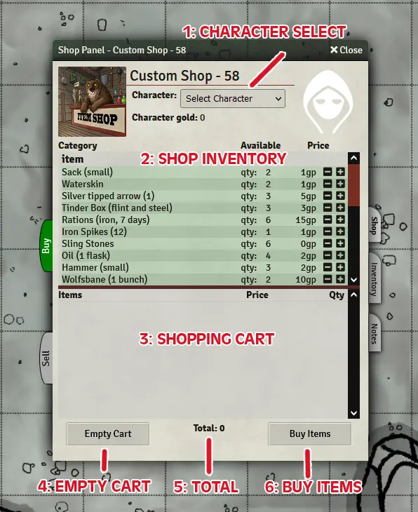
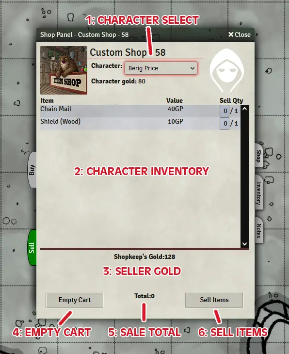
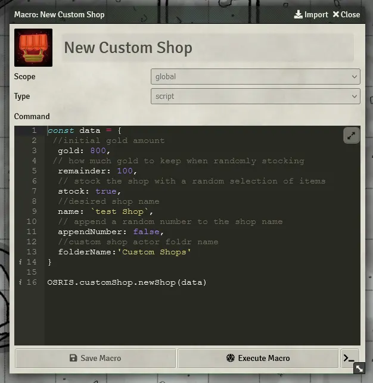

# osr-item-shop

### installation

instal inside foundry using the following url:

https://raw.githubusercontent.com/RabidOwlbear/osr-item-shop/main/module.json

### features

Adds an item shop interface.

Includes Ose SRD item and equipment compendium.

Adds ability to create custom shop actors.
- Custom shop actors require the link actor data box to be checked in the prototype token options for the shop to function.
- To allow users to access a shop, set the shop actors permissions to observer for all usrs, or for whichever users you wish to allow access to the shop.
- a macro is provided that will create a random shop with the option to randomly stock it with included SRD items.

## Using the custom shop

### Buying items

1. Character Select: This dropdown will be populated with the names of all characters the of which the user has owner permissions. When selected the Sell tab will be populated with the items currently in the selected actors inventory. A character must be selected to buy or sell items.
2. Shop Inventory: This panel is populated with all available items in the shops inventory. Clicking on the plus and minus buttons will add/remove 1 of that item type to the shopping cart. The item quantity can also be changed via text input in the shopping cart.
3. Shopping Cart: Items added to the cart will appear here. 
4. Empty Cart: This will remove all items from the shopping cart.
5. Total: This is the total cost of the transaction in gold pieces.
7. Buy Items: Clicking this button will add the selected items to the selected actors inventory and deduct the total amount from the selected actors gp. This also removes the items from the shops inventory and adds the total of the sale to the shops gp. The shop and shop actor windows will then close.

### Selling items 

1. Character Select: Same as the Buy tab.
2. Character Inventory: Lists all the items in the selected character's inventory. The input displays how many of each item type the player wishes to sell. This defaults to zero. Changing the quantity updates the sale total.
3. Seller Gold: This displays how much gold the seller has.
4. Empty Cart: This will set all item input values on the sell tab to 0.
5. Total: This displays the total amount of the transaction in gold pieces.
6. Sell Items: Clicking this button will remove all items selected for sale fropm the selected character's inventory and add the total of the sale to the selected actors gp. It will then add the selected items to the shops inventory and deduct the total amount from the shops gp.

### Creating Custom Shops

Custom shops are created using the provided macro.

Shown above is the default macro included. Several of the options can be adjusted to the users preference.

- **Gold:** Number - The initial amount of gold to start with. If random stock is not selected this will be the total amount of gold in the shop.
- **Remainder:** Number - How much gold to leave as remainder when randomly stocking the shop. eg. setting a gold value of 200, and a remainder value of 50, when randomly stocking the shop, it would 'buy' 150gp worth of items leaving 50gp in the shops inventory.
- **Stock:** true/false - If set to true teh shop will buy a random assortment of included SRD items with a total value of gold minus remainder.
- **Name:** 'String' - Defines the name of the shop actor created, must be in quotes. If no string is provided the macro will default to a name of 'Custom Shop'.
- **appendNumber:** true/false = if set to true a random number between 1 and 100 will be appended to the shop name. 
- **folderName:** 'String' - Defines the name of the folder the actor will be placed in, if no folder with that name exists one will be created and the actor placed inside it.

Clicking the macro will create a new actor,and place it in a folder matching the folder name provided, creating one if it does not exist. if random stock is enabled, the actor will be stocked with a random selection of items from the provided SRD items following the procedure detailed above. 

#### Buy/Sell Chat Message settings
- Send shopping cart to chat message on buy: when checked the custom shop will output the shopping cart to chat when items are bought.
- Send shopping cart to chat message on sell: when checked the custom shop will output the shopping cart to chat when items are sold.
- GM whisper shopping cart messages: when checked the chat messages from the previous settings will be whispered to the GM istead of being sent to chat.
