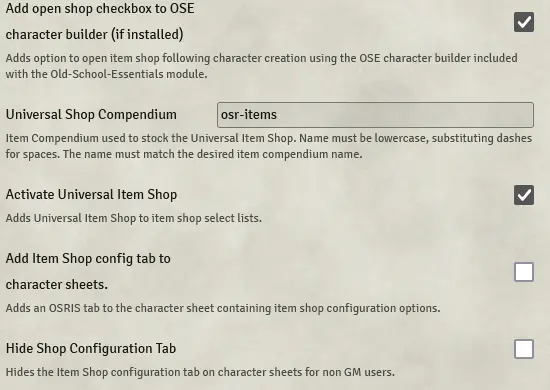
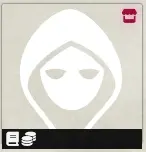
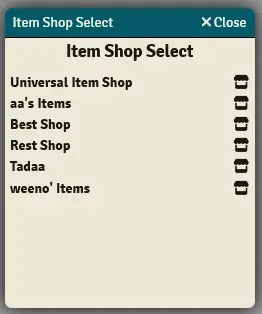
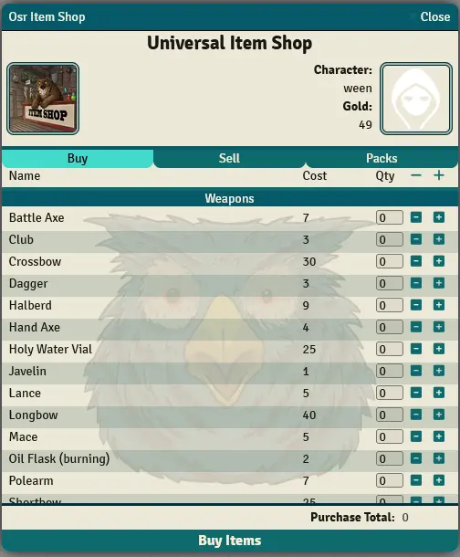
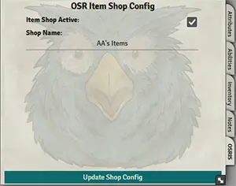

# osr-item-shop

Created by RabidOwlbear.

Supprted via patreon: https://patreon.com/RabidOwlbear

### installation

instal inside foundry using the following url:

https://raw.githubusercontent.com/RabidOwlbear/osr-item-shop/main/module.json

### features

Adds an item shop interface.

Includes an item and equipment compendium and a macro compendium containing some helpful macros.

## Module Settings

- Add checkbox to OSE character builder: adds item shop box to the character builder if installed.
- Universal Item Shop Compendium: Name of the pack used for the universal item shop. This name must be lowercase and contain no spaces, dashes my be used instead. This name must match the name of an existing world compendium. The default 'osr-items' may also be used.
- Activate Universal Item Shop: if checked adds the Universal Item Shop to all item shop lists.
- Add Item Shop Config Tab To Character Sheets: If checked adds an config tab labled OSRIS to the character sheet. This allows for the activation of a character actor as an item shop.
- Hide Shop Config Tab From Non Gm Users: Hides the shop config tab for non GM users

## Item Shop Select

- Shop Button: Clicking the shop button located in the top right corner of the portrait panel on mouseover opens the Item Shop Select window.

 - Shop List: All active Item shops will be listed here. Clicking the shop button to the right of the shop name will open that shop and close the select window.
 
## Using the Universal Item Shop

The universal Item shop consists of three separate tabs:

- The buy tab (pictured above) may be used to buy items for the selected character. individual items my be added by pressing the plus and minus buttons next to each item. The purchase total display will be updated accordingly.
- The Sell tab where one might sell existing character items.
- The Packs tab where a player can buy a preselected group of items for the selected character.

Clicking the buy or sell button at the bottom of the sheet will buy/sell the selected items or pack.

The Universal Item Shop may be opened via an included macro or from the Item SHop Select window.

## Shop Config Tab

- Item Shop Active: Toggles the display od this shop in item shop lists.
- Shop Name: A shop name may be entered here. 
- Update Shop Config Button: Updates the shop config settings. Settings will not be saved without clicking the update button.

